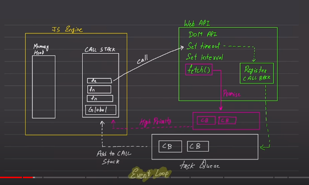

## JavaScript is a

- synchronous language (every thing happens in sequence)
- Single threaded

## Execution Context

- execute one line of code at a Time (each operation waits for the last one to complete before executing next line)
- console.log("hello") -- 1
- console.log("hello") -- 2
  Call Stack Memory Heap

//Above is behavior of default engine of JavaScript

## Blocking Code

- Block the flow of program
- Read file sync

## Non Blocking Code

- Does not load block execution
- Read file Async

JavaScript engine is made up of Call stack & Memory Heap,
